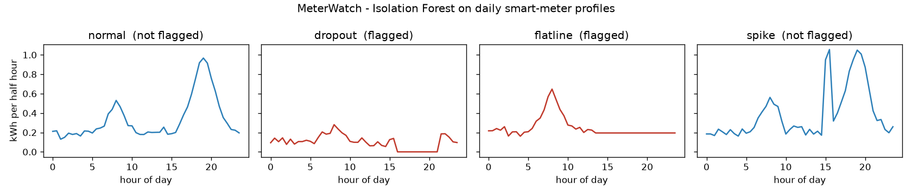
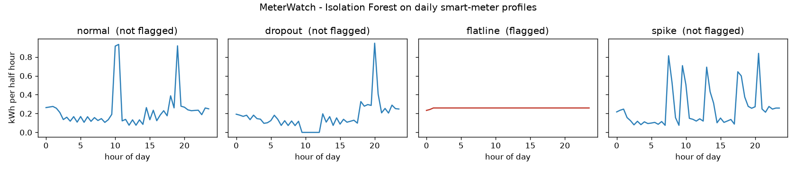

# MeterWatch: Fault Detection in Smart-Meter Data

A small machine-learning project that detects faulty days in half-hourly smart-meter readings. It is inspired by communication and reliability failures I worked on in the UK DCC smart metering programme.

## Problem
Smart meters send energy readings every 30 minutes. When communication or the device fails, the data shows tell-tale patterns:

| Fault | What it looks like | Real-world cause |
|---|---|---|
| **Dropout** | readings drop to zero | communication loss (e.g. Zigbee HAN / WAN failure) |
| **Flatline** | the same value repeats | meter or comms hub stuck |
| **Spike** | an implausible short surge | faulty reading or tampering |

## Method
1. Turn each meter-day into a 48-point load profile
2. Inject labelled faults into 5% of days, so detection can be measured
3. Extract 7 simple features (zero count, repeated values, largest jump, peak-to-average ratio, …)
4. Compare a **rule-based threshold** with an **Isolation Forest** (unsupervised ML)
5. Evaluate with precision, recall and F1 score

## Results on demo data (40 simulated homes × 60 days)

| Model | Precision | Recall | F1 | Dropouts caught | Flatlines caught | Spikes caught |
|---|---|---|---|---|---|---|
| Rule-based threshold | 0.39 | 0.53 | 0.45 | 100% | 0% | 58% |
| **Isolation Forest** | **0.94** | **0.94** | **0.94** | 100% | 100% | 77% |



**Key finding:** simple rules catch obvious dropouts but miss stuck meters entirely. The ML model catches all three fault types with far fewer false alarms. Short spikes remain the hardest to detect, because they look similar to normal evening peaks.

## Results on real data (London households)

Run on `block_0.csv` from the Smart Meters in London dataset (about 50 real households), with the same fault injection and settings:

| Model | Precision | Recall | F1 | Dropouts caught | Flatlines caught | Spikes caught |
|---|---|---|---|---|---|---|
| Rule-based threshold | 0.29 | 0.43 | 0.35 | 100% | 1% | 27% |
| **Isolation Forest** | **0.47** | **0.47** | **0.47** | 69% | 44% | 27% |



**What changed on real data:**
- Isolation Forest still beats the rule-based baseline (F1 0.47 vs 0.35), but performance roughly halves compared with demo data
- Real homes have sharp, irregular peaks (kettles, cookers, showers), so genuine behaviour looks like a fault, and some faults look normal
- Rules still catch every dropout (any zero reading), but almost no stuck meters

**Lesson:** detectors tuned on clean, simulated profiles can look far better than they are. Real-data validation is essential.

## Run it
```bash
pip install -r requirements.txt
python meterwatch.py                          # demo data
python meterwatch.py --data block_0.csv     # real London data
```
Real data: [Smart Meters in London (Low Carbon London)](https://www.kaggle.com/datasets/jeanmidev/smart-meters-in-london). Use any half-hourly file, e.g. `halfhourly_dataset/block_0.csv` (about 50 homes). Both the Kaggle layout (`tstp`, `energy(kWh/hh)`) and the original LCL layout (`DateTime`, `KWH/hh`) are supported.

## Next steps
- Compare each home with its own normal pattern (per-home baselines) to reduce false alarms from natural spikes
- Test across more London blocks to check the results are stable
- Add time-series models (e.g. autoencoder) to improve spike detection
- Explore detection of cyber attacks such as false data injection

## Author
Lopamudra Panigrahi · [Research portfolio](https://lopamudra330.github.io)
